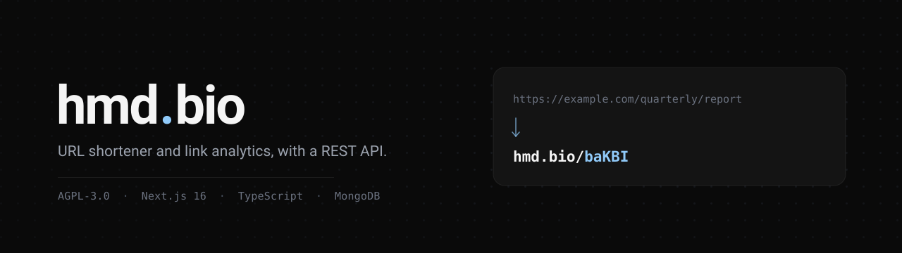

# HMD.bio

**URL shortener and link analytics platform**

[](LICENSE)
[](https://nextjs.org)
[](https://www.typescriptlang.org)

A URL shortener with owner dashboards, click analytics, custom domains, a REST API and an admin area. Built by [HMD Developments](https://hmddevs.org). Live since May 2023; rebuilt from the ground up in 2026 with a modern stack.

**Live at [hmd.bio](https://hmd.bio)** · **API reference at [hmd.bio/docs](https://hmd.bio/docs)**

## Features

### For everyone
- Shorten URLs instantly: custom or auto-generated keywords
- Link preview pages (`hmd.bio/keyword+`) showing destination, title and creation date
- Password-protected links (bcrypt-hashed, unlocked via a dedicated `/password/[keyword]` gate)
- REST API with an interactive reference at `/docs`

### For registered users
- Signup with email verification (`/signup`, verification link via Resend; admin notified of the new pending account)
- Dashboard for creating and managing links (`/dashboard`, `/dashboard/links`, `/dashboard/links/[keyword]`)
- Per-link analytics: clicks over time, referrers, countries, browsers, operating systems, direct-vs-referred split
- **Custom domains** (`/dashboard/domains`): attach your own hostname, verify ownership by TXT record, then create short links on it. Apex domains and subdomains are both supported, certificates are provisioned automatically, and DNS is re-checked daily. Up to `MAX_DOMAINS_PER_USER` (3 by default) per account
- QR code generation for any owned link
- Bulk link import via the API, up to 500 links per request, each optionally on a different verified domain
- CSV export of owned links (streamed, so large accounts do not time out)
- API key management (create/list/revoke `hmd_*` Bearer keys tied to the account)
- Account settings page (`/dashboard/settings`) and additional dashboard tools (`/dashboard/tools`)
- Per-account click log (`/dashboard/clicks`)
- Bookmarklet for one-click shortening from any page (`/bookmarklet`)
- Own-password change endpoint

### For admins
- Admin dashboard (`/admin`) for reviewing all links and site-wide settings
- Per-link deep analytics with a country map
- Admin user management (`/admin/users`): search, review and manage registered accounts
- Admin domain management (`/admin/domains`): review every attached domain, and suspend or unsuspend one

## Roadmap

Worth considering later:
- Redis-backed link cache on the hot redirect path (a fast-path placeholder was pulled from `proxy.ts` pending a proper design)
- Scheduled exports, on top of the existing on-demand CSV export
- Link expiration reminders via Resend
- Webhook notifications on click milestones
- Admin audit log

## Tech Stack

| Layer | Technology |
|-------|-----------|
| Framework | Next.js 16 (App Router, Turbopack) |
| Language | TypeScript 5 (strict) |
| Database | MongoDB Atlas + Mongoose 9 |
| Cache | Upstash Redis (rate limiting; optional, degrades gracefully) |
| Auth | NextAuth v5 beta (credentials sessions + `hmd_*` Bearer API keys) |
| UI | MUI v7 + Tailwind CSS v4 |
| Bot Protection | Cloudflare Turnstile |
| Email | Resend |
| Monitoring | Sentry 10 |
| Hosting | Vercel (lhr1) |

## Project Structure

```
src/
├── app/
│   ├── (auth)/               # Login/signup route group
│   ├── (legal)/              # Terms, privacy, cookies, AUP route group
│   ├── admin/                # Admin dashboard, login, user and domain management
│   ├── dashboard/            # User dashboard (links, domains, settings, clicks, tools)
│   ├── bookmarklet/          # One-click shortening bookmarklet target
│   ├── docs/                 # API reference, rendered from src/lib/openapi.ts
│   ├── llms-full.txt/        # The whole OpenAPI spec as one markdown file, generated
│   ├── api/
│   │   ├── v1/               # Public REST API (see below)
│   │   ├── internal/         # INTERNAL_SECRET-gated routes, called by proxy.ts and cron only
│   │   ├── admin/            # Admin-only server actions/routes
│   │   └── auth/[...nextauth]/  # NextAuth handler
│   ├── [keyword]/            # Catch-all short URL redirect target (see proxy.ts)
│   ├── stats/[keyword]/      # Owner-facing stats page
│   ├── preview/[keyword]/    # Link preview page
│   └── password/[keyword]/   # Password-protected link gate
├── lib/                      # auth.ts, db.ts, rate-limit.ts, api-response.ts, ip.ts, openapi.ts, domains.ts, validations.ts, utils.ts
├── models/                   # Mongoose schemas (Link, Click, User, Domain, Option, ...)
└── proxy.ts                  # Edge middleware: resolves short URLs via /api/internal/resolve
```

## Quick Start

### Prerequisites

- Node.js 20+
- pnpm 9+
- MongoDB (local or Atlas)

### Installation

```bash
git clone https://github.com/hmddevs/hmd-bio.git
cd hmd-bio
pnpm install
cp .env.example .env.local
# Edit .env.local with your values
pnpm dev
```

Open [http://localhost:3000](http://localhost:3000) in your browser.

### Available Scripts

```bash
pnpm dev          # Start development server (Turbopack)
pnpm build        # Production build + Sentry source map upload
pnpm lint         # ESLint (eslint-config-next)
npx tsc --noEmit  # Typecheck (no test suite defined)
```

## Configuration

`.env.example` is the authoritative list and carries inline notes for each entry. The tables below summarise it.

### Required

| Variable | Description |
|----------|-------------|
| `MONGODB_URI` | MongoDB Atlas connection string |
| `AUTH_SECRET` | NextAuth secret (`openssl rand -base64 32`) |
| `AUTH_URL` | Canonical URL (e.g. `https://hmd.bio`) |
| `NEXT_PUBLIC_TURNSTILE_SITE_KEY` | Cloudflare Turnstile site key |
| `TURNSTILE_SECRET_KEY` | Cloudflare Turnstile secret key |
| `INTERNAL_SECRET` | Secret gating `/api/internal/*`; those routes fail closed if unset |
| `IP_HASH_SALT` | Salt for hashing visitor IPs before analytics storage |
| `IP_ENCRYPTION_KEY` | 64-char hex key for admin-only raw IP decryption |
| `NEXT_PUBLIC_PRIMARY_DOMAIN` | The platform's own domain. Any link created without an explicit domain belongs to it, and a custom host is anything that is not it |

### Optional

| Variable | Description |
|----------|-------------|
| `UPSTASH_REDIS_REST_URL` / `UPSTASH_REDIS_REST_TOKEN` | Upstash Redis (rate limiting). Absent: rate limiting falls back to a per-instance in-memory limiter; redirects and the API keep working |
| `RESEND_API_KEY` | Resend API key for transactional email |
| `EMAIL_FROM` | From address on transactional email |
| `SENTRY_DSN` | Sentry error tracking |
| `ADMIN_EMAIL` | Admin notification address |

### Custom domains

Required only if you want users to attach their own hostnames. Without these, the platform runs fine on its primary domain alone.

| Variable | Description |
|----------|-------------|
| `VERCEL_API_TOKEN` | Vercel REST API token with domain read/write on the project below. Used to attach and detach user domains and to read certificate status |
| `VERCEL_PROJECT_ID` | The Vercel project that user domains are attached to |
| `VERCEL_TEAM_ID` | Only needed when that project belongs to a team rather than a personal account |
| `CRON_SECRET` | Authorises the daily cron jobs (domain re-verification, click retention). Vercel Cron sends it as `Authorization: Bearer <value>`, which is why it is separate from `INTERNAL_SECRET` |
| `CLICK_RETENTION_DAYS` | Click retention period, in whole days. A policy number, not a secret. Setting it is the act that switches scheduled retention on; while it is unset, empty or not a positive integer the job runs and touches nothing. There is no default |
| `VERCEL_APEX_IP` / `VERCEL_CNAME_TARGET` | The DNS targets handed to users in their setup instructions |
| `MAX_DOMAINS_PER_USER` | Per-account domain cap. Defaults to 3 |

## API

Base URL: `https://hmd.bio/api/v1`. All responses are JSON, shaped as `{ success, data?, error?, statusCode }`.

Three ways to read the reference:

- **[hmd.bio/docs](https://hmd.bio/docs)** — the interactive reference, with code samples and a request playground.
- **[hmd.bio/api/docs](https://hmd.bio/api/docs)** — the raw OpenAPI 3 specification as JSON.
- **[hmd.bio/llms-full.txt](https://hmd.bio/llms-full.txt)** — the whole specification as a single self-contained markdown file, generated from the same source. Intended for LLMs and coding agents; see also [llms.txt](https://hmd.bio/llms.txt).

### Authentication

- **Session cookie** — for browser-driven calls from the dashboard.
- **Bearer API key** — `Authorization: Bearer hmd_<key>`, issued and revoked from `/dashboard` via `POST/GET/DELETE /api/v1/auth/api-keys`. Keys are stored hashed; the raw value is shown once, at creation.

Public endpoints (`/shorten`, `/expand`, `/stats`) accept either an authenticated caller or none; authenticated endpoints (link management, per-link stats, exports, domains, API keys) require a session or API key and return `401` otherwise.

### Rate limits

Upstash-backed sliding window, per caller:

| Tier | Limit |
|------|-------|
| Public (unauthenticated) | 30 requests/minute |
| Authenticated (session or API key) | 100 requests/minute |

A `429` is returned once the limit is exceeded. If Upstash is unreachable, requests still get rate-limited via an in-memory fallback rather than being left unlimited.

### Example requests

Shorten a URL (public; Turnstile token required only for unauthenticated callers):

```bash
curl -X POST https://hmd.bio/api/v1/shorten \
  -H "Content-Type: application/json" \
  -d '{"url": "https://example.com/very/long/path", "turnstileToken": "<token>"}'
```

Shorten onto one of your own verified domains (requires auth):

```bash
curl -X POST https://hmd.bio/api/v1/shorten \
  -H "Authorization: Bearer hmd_<your-key>" \
  -H "Content-Type: application/json" \
  -d '{"url": "https://example.com/quarterly/report", "domain": "go.example.com"}'
```

Expand a short URL:

```bash
curl "https://hmd.bio/api/v1/expand?keyword=abc123"
```

Fetch analytics for an owned link (requires auth):

```bash
curl "https://hmd.bio/api/v1/stats/abc123?period=7d" \
  -H "Authorization: Bearer hmd_<your-key>"
```

## Security

- **CSP**: strict Content-Security-Policy with script/style/frame restrictions
- **HSTS**: 2-year max-age with includeSubDomains and preload
- **Headers**: X-Frame-Options DENY, X-Content-Type-Options nosniff, Referrer-Policy strict-origin
- **Permissions-Policy**: camera, microphone, geolocation blocked
- **Rate limiting**: per-tier limits via Upstash Redis, degrading to an in-memory fallback if Redis is unavailable
- **Bot protection**: Cloudflare Turnstile on public write endpoints
- **IP privacy**: visitor IPs are hashed for analytics and AES-encrypted for admin-only decryption; raw IPs are never logged

Found a vulnerability? Please report it privately rather than opening a public issue. See [SECURITY.md](SECURITY.md).

## Deployment

### Vercel

1. Push to GitHub
2. Import the project in Vercel
3. Add environment variables
4. Deploy

```bash
vercel --prod
```

The daily crons are declared in `vercel.json` and need `CRON_SECRET` set in the project's environment: domain re-verification at 04:00 and click retention at 04:30. Custom domains additionally require the Vercel API credentials listed above, because attaching a user's hostname is a Vercel project operation.

Click retention anonymises the personal fields on old clicks (encrypted address, IV, user agent) and keeps the anonymous analytics row. It stays inert until `CLICK_RETENTION_DAYS` is set to a positive whole number of days, and it never assumes a default. Before setting it for the first time, dry-run `npx tsx scripts/anonymise-old-clicks.ts --age-days=<the same number>`, which writes nothing and prints exactly how many rows the first live run would rewrite. There is deliberately no TTL index on the clicks collection.

## Contributing

Issues and pull requests are welcome. Please run `pnpm lint` and `npx tsc --noEmit` before opening a PR, and note any new environment variable in both `.env.example` and this README.

Be aware of the licence before you fork: see below.

## Licence

[GNU Affero General Public License v3.0](LICENSE).

AGPL-3.0 is a strong copyleft licence with a network clause. In short: you may use, modify and redistribute this code, but if you run a modified version as a network service, you must offer that service's users the corresponding source of your modified version. If that does not suit your use, do not fork this repository.

---

Built by [HMD Developments](https://hmddevs.org)
